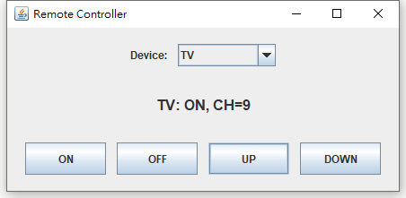
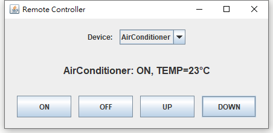

# 通用型遙控器（DIP）作業報告

## 基本資料
- **姓名**：王建葦
- **學號**：D1210799
- **班級**：資訊三乙
- **題目**：通用型遙控器

## 設計方法概述
本作業依照 DIP（Dependency Inversion Principle，依賴反轉原則）設計：

- **高層模組**：`RemoteController`
  - 只依賴抽象介面 `ControllableDevice`
  - 不直接依賴 `Tv` 或 `AirConditioner` 的具體類別
- **低層模組**：`Tv`、`AirConditioner`
  - 以「實作介面」方式提供功能
  - 由 UI 在執行期間切換遙控器控制對象（透過 `RemoteController.setDevice(...)`）

### 主要類別與職責
- `ControllableDevice`
  - 定義共同操作：`on/off/up/down`
  - 定義 UI 顯示所需資訊：`getStatusText()`、`getName()`、`isOn()`
- `Tv`
  - 預設頻道 7
  - 頻道範圍 1~15，超出邊界時維持在邊界
- `AirConditioner`
  - 預設溫度 25°C
  - 溫度範圍 20~30°C，超出邊界時維持在邊界
- `RemoteController`
  - 持有一個 `ControllableDevice`（以建構子注入，並可用 setter 切換）
  - 透過 `pressOn/pressOff/pressUp/pressDown` 呼叫裝置行為
- `RemoteControllerFrame`（Swing UI）
  - 提供裝置下拉選單切換（TV / AirConditioner）
  - 提供按鈕 `ON / OFF / UP / DOWN`
  - 顯示目前狀態（例如 `TV: ON, CH=7` 或 `AirConditioner: OFF, TEMP=25°C`）

## 程式、執行畫面及其說明

### 執行方式
請在專案根目錄使用 PowerShell 執行（需先安裝 JDK 8+）：

```powershell
mkdir out -ErrorAction SilentlyContinue
javac -encoding UTF-8 -d out (Get-ChildItem -Recurse -Filter *.java src | ForEach-Object FullName)
java -cp out fcu.remote.App
```

### 操作說明
- 由視窗上方下拉選單選擇要控制的裝置（TV / AirConditioner）
- 按 `ON`：開機
- 按 `OFF`：關機
- 按 `UP / DOWN`：調整頻道或溫度（若裝置為 OFF，則不變動）
- 中央文字會即時顯示目前狀態

### 執行畫面

**TV 模式**（Device: TV，開機後按兩下 UP，CH 從預設 7 變為 9；UP/DOWN 在 1~15 邊界維持不變）



**AirConditioner 模式**（Device: AirConditioner，開機後按兩下 DOWN，TEMP 從預設 25°C 變為 23°C；UP/DOWN 在 20~30 邊界維持不變）



## 參考資料
- Oracle Java Swing 文件（Swing 基本元件與事件處理）
- DIP（Dependency Inversion Principle）相關教材/課堂講義

## AI 使用狀況與心得

### 概述提問的內容，以及 AI 的回答
本次使用 AI 協助：
- **釐清作業需求與架構**
  - 提問：如何依 DIP 設計通用遙控器（可控制 TV 與冷氣）？
  - 回答摘要：以 `ControllableDevice` 抽象介面解耦高層（遙控器）與低層（裝置），並用 Swing 建立 UI 進行操作與切換控制對象。
- **產生對應的 Java 程式骨架與 Swing UI**
  - 提問：完成 Java 程式碼
  - 回答摘要：完成 `Tv`、`AirConditioner`、`RemoteController`、`RemoteControllerFrame` 與 `App` 入口點；並提供 `README.md` 的編譯執行指令。
- **版本控制**
  - 提問：提交 commit、push
  - 回答摘要：將新增程式碼與文件提交 commit，並推送到遠端。

### 你手動（沒有用 AI）的部份
- 撰寫 Agent.md 檔案
- 建立程式碼基礎架構與命名規則
- 在本機環境進行編譯/執行、操作 UI 與截圖
- 依個人實際流程補充本報告的「參考資料」與「心得」

### 心得（AI 的實用性、限制、對你學習的影響）
- **實用性**：能快速把需求轉成可運行的最小版本，並提醒 DIP 分層重點與 UI 元件組合方式。
- **限制**：AI 無法替代實際在本機截圖、或確認你課堂對格式/內容的特殊要求；報告內容仍需自己校對與補齊參考資料。
- **對學習的影響**：更快把時間放在理解「抽象介面解耦」與 Swing 事件流程，而不是卡在專案起手式。